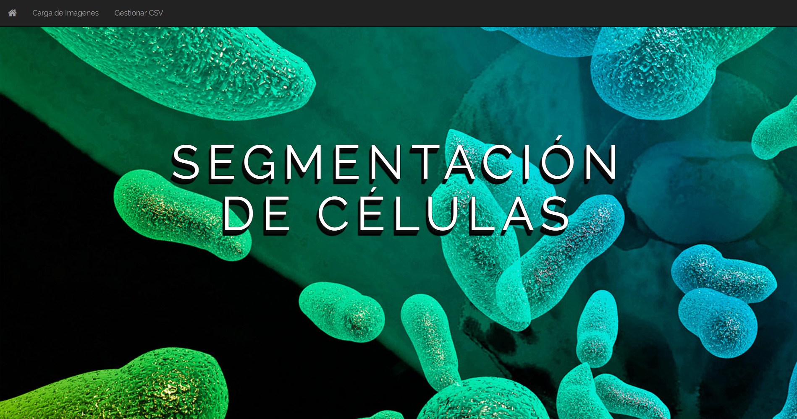

# Cell-Segmentation-System

System that preprocesses, segments and detects cells in glioblastoma tissue in digital images, taken by a fluorescence-based microscope

## Getting Started

These instructions will get you a copy of the project up and running on your local machine for development and testing purposes. See deployment for notes on how to deploy the project on a live system.

### Prerequisites

In order to execute or test the current project you need [Python 3.x](https://www.python.org/downloads/) and the following libraries on your computer.

#### Theano

```
$ pip install --upgrade --no-deps git+git://github.com/Theano/Theano.git
```

#### Tensorflow

```
$ pip install tensorflow
```

#### Keras

```
$ pip install Flask
```

#### Flask

```
$ pip install --upgrade keras
```

### Installing

1. Download or clone the repository.

```
$ git init
$ git clone https://github.com/ddelgadoJS/Cell-Segmentation-System
```

2. Execute the `run.py` file.

```
$ python run.py
```

3. Go to `localhost` on any explorer (Google Chrome, Firefox, Edge, Safari, Opera).

Once this was completed you will have access to the entire functionality of the project.



## Running the tests

To run the tests you must execute the `test_run.py` file.

```
$ python test_run.py
```

You can even add your own tests for the system on this file.

### Tests explanation

### Coding style tests

## Deployment

## Built With

* [Flask](http://flask.pocoo.org/) - The web microframework used
* [Keras](https://keras.io/) - The Python Deep Learning library used
* [Pandas](https://pandas.pydata.org/) - Used to generate CSV reports

## Contributing

Please read [CONTRIBUTING.md](CONTRIBUTING.md) for details on our code of conduct, and the process for submitting pull requests to us.

## Versioning

We are not defining versions for the moment.

## Authors

* **Ignacio Cantillo** - [icantillo](https://github.com/icantillo)
* **Daniel Delgado** - [ddelgadoJS](https://github.com/ddelgadoJS)
* **Kevin Montoya** - [kevinmm17](https://github.com/kevinmm17)

See also the list of [contributors](https://github.com/ddelgadoJS/Cell-Segmentation-System/graphs/contributors) who participated in this project.

## License

This project is licensed under the MIT License - see the [LICENSE.md](LICENSE) file for details

## Acknowledgments

* M. Sc. Saúl Calderón Ramírez - contributed with models for the system.
